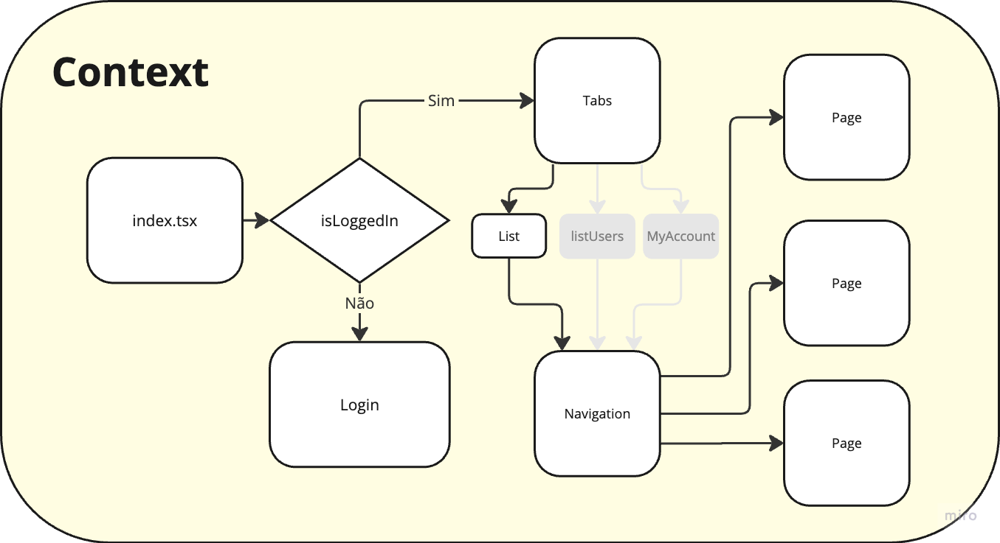

# School Blog Mobile

Este repositório é parte de um projeto de pós-graduação da FIAP. O **School Blog** é uma plataforma onde professores interagem com alunos por meio de postagens em um blog. Esta é a versão mobile da aplicação.

## ⚡ 1. Executando o Projeto

1. Abrir o emulador Android Studio (Pixel 4 XL, Android 14.0 arm64-v8a).
2. No terminal, rodar o seguinte comando:

    ```bash
    npm install
    npm start
    ```

3. Para rodar no Android aberto:

    ```bash
    npm run android
    ```

---

## 📚 2. Fluxos da Aplicação



-   **Autenticação:**  
    Ao entrar na aplicação, é verificado se existe um cookie chamado `school-blog-jwt`. Este cookie contém o JWT que autoriza as requisições ao backend.

    -   Se o JWT for do tipo `ADMIN`, o usuário terá acesso total.
    -   Usuários com as roles `TEACHER` ou `STUDENT` terão acesso apenas aos componentes específicos de suas permissões.

-   **Segurança:**  
    Mesmo que alguém tente burlar o frontend, todas as requisições ao backend exigem um JWT válido, garantindo que apenas informações autorizadas sejam acessadas.

---

## 🛠️ 3. Estrutura de Componentes

```plaintext
app/
├── index.tsx
├── _layout.tsx
├── isLoggedIn.tsx
├── (tabs)/
│   ├── _layout.tsx
│   ├── List.tsx
│   ├── MyAccount.tsx
│   ├── UserList.tsx
├── components/
├── contexts/
├── utils/
├── assets/
└── typings/
```

---

## 🔑 4. Regras de Acesso

### **1. ADMIN**

Permissão total, incluindo gerenciamento de usuários e artigos.

-   **`./components/CreateUser`**  
    Cria e atualiza usuários.  
    **Rota:** `./components/admin/CreateUser/[id]`.

-   **`./components/ListUsers`**  
    Lista usuários do sistema.  
    **Rota:** `/admin/ListUsers`.

### **2. ADMIN e TEACHER**

Permissão para gerenciar e visualizar artigos.

-   **`./components/List`**  
    Lista artigos com opções de editar e remover.  
    **Rota:** `./components/List`.

-   **`./components/CreateUpdate`**  
    Formulário para criar ou atualizar artigos.  
    **Rotas:** `./components/createUpdate/[id]`.

### **3. STUDENT, ADMIN e TEACHER**

Acesso limitado à visualização de artigos e gerenciamento de conta.

-   **`./components/List`**  
    Exibe artigos sem opções de edição/remoção.  
    **Rota:** `./components/List`.

-   **`./components/ViewArticle`**  
    Exibe o conteúdo de um artigo.  
    **Rota:** `./components/ViewArticle/:id`.

-   **`./components/MyAccount`**  
    Permite que cada usuário atualize seus próprios dados.  
    **Rota:** `./(tabs)/MyAccount`.

---

## 🔧 5. Ferramentas e Utilitários

-   O repositório conta com ferramentas customizadas e hooks específicos, organizados na pasta `./utils`.
-   Fontes e imagens estão disponíveis na pasta `./assets`.
-   Tipos utilizados no projeto estão disponíveis na pasta `./typings`.
